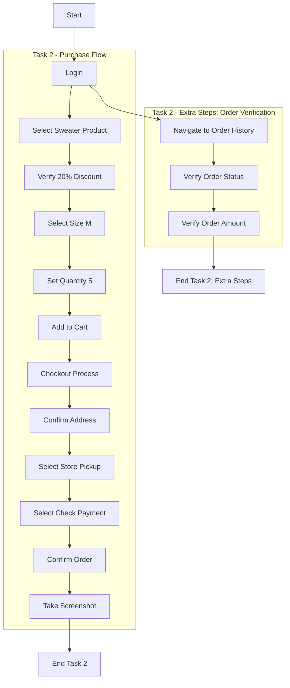

# Web Automation Testing Project

## Project Overview
This automation testing framework tests the e-commerce functionality of MyStore TestLab using Selenium WebDriver with Java. The project follows the Page Object Model (POM) design pattern and uses Cucumber for BDD testing.

## What is BDD (Behavior Driven Development)?
BDD is a way of writing tests in plain English that everyone can understand - not just programmers. It follows a simple pattern:

- **Given**: The initial context (e.g., "Given I am logged into the store")
- **When**: An action takes place (e.g., "When I add a sweater to cart")
- **Then**: The expected outcome (e.g., "Then the cart should contain 1 item")

Example from our project:

```gherkin
Given the user is logged in with email "test@test.com" and password "test123"
When the user selects the Hummingbird Printed Sweater
Then the discount should be 20%
```

This approach helps:
- Non-technical team members understand test scenarios
- Developers know exactly what to implement
- Testers have clear acceptance criteria
- Documentation stays up-to-date with actual tests

## Test Flow Diagram



## Project Structure

```
src/
├── test/
│ ├── java/
│ │ ├── pages/
│ │ │ ├── AuthenticationPage.java
│ │ │ ├── CheckoutPage.java
│ │ │ ├── MyAccountPage.java
│ │ │ ├── OrderHistoryPage.java
│ │ │ ├── ProductPage.java
│ │ │ └── ShoppingCartPage.java
│ │ ├── steps/
│ │ │ ├── PurchaseSteps.java
│ │ │ └── PurchaseStepsTest.java
│ │ └── features/
│ │ └── purchase.feature
│ └── resources/
│ └── chromedriver
└── pom.xml
```

### Page Objects
Located in `src/test/java/pages/`:

#### 1. AuthenticationPage
- Handles user login functionality
- Key methods:
  - `loginAs(email, password)`: Performs login
  - `getLoggedUsername()`: Verifies logged-in user

#### 2. MyAccountPage
- Manages navigation through the store
- Key methods:
  - `navigateViaCategory()`: Navigates to product categories
  - Contains locators for clothes category and specific products

#### 3. ProductPage
- Handles product-specific actions
- Key methods:
  - `verifyDiscount(expectedDiscount)`: Checks product discount
  - `selectSize(size)`: Chooses product size
  - `setQuantity(quantity)`: Sets product quantity using increment button
  - `addToCart()`: Adds product to shopping cart
  - `proceedToCheckout()`: Initiates checkout process

#### 4. ShoppingCartPage
- Manages shopping cart functionality
- Key methods:
  - `proceedToCheckout()`: Continues to checkout
  - `getTotalAmount()`: Retrieves cart total

#### 5. CheckoutPage
- Handles checkout process
- Key methods:
  - `confirmAddress()`: Confirms shipping address
  - `selectPickupMethod()`: Chooses delivery option
  - `selectPayByCheck()`: Selects payment method
  - `placeOrder()`: Completes order
  - `takeScreenshot()`: Captures order confirmation

#### 6. OrderHistoryPage
- Manages order history verification
- Key methods:
  - `goToOrderHistory()`: Navigates to order history
  - `getLatestOrderStatus()`: Retrieves order status
  - `getLatestOrderAmount()`: Gets order amount

### Test Implementation

#### Steps Definition (`PurchaseSteps.java`)
- Contains Cucumber step definitions
- Initializes WebDriver and page objects
- Implements test steps using page object methods
- Includes cleanup with `@After` hook

#### Test Runner (`PurchaseStepsTest.java`)
- Configures Cucumber test execution
- Specifies feature file location and step definitions
- Generates HTML test reports

## Key Design Decisions

1. **Page Object Model (POM)**
   - Separates test logic from page interactions
   - Makes tests more maintainable and reusable
   - Reduces code duplication

2. **WebDriverWait**
   - Used for explicit waits
   - Ensures elements are ready before interaction
   - More reliable than Thread.sleep()

3. **Debug Logging**
   - Extensive logging for troubleshooting
   - Tracks navigation and action flows
   - Helps identify test failures

4. **Simple Solutions Over Complex Ones**
   - Example: Using increment button clicks instead of direct value input
   - More reliable in real browser interactions
   - Mimics actual user behavior

## Dependencies
- Selenium WebDriver: Browser automation
- Cucumber: BDD testing framework
- JUnit: Test execution and assertions
- Chrome WebDriver: Browser driver

## Running Tests
1. Ensure Chrome WebDriver is installed
2. Run `PurchaseStepsTest.java` as JUnit test
3. Check generated reports in `target/cucumber-report.html`

## Best Practices Used
- Descriptive method names
- Proper exception handling
- Clear debug logging
- Page object encapsulation
- Explicit waits for reliability
- Screenshot capture for failures

## Future Improvements
- Add more detailed assertions
- Implement cross-browser testing
- Enhance reporting
